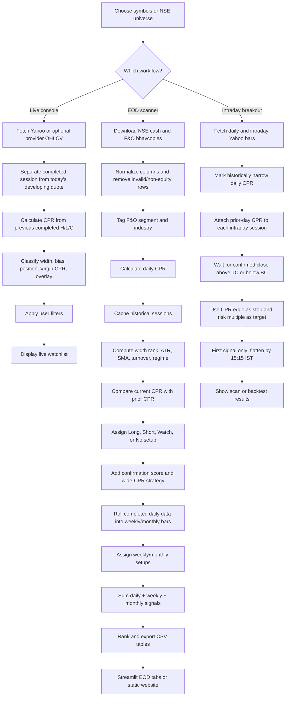

# CPR Console: Layman Documentation

**Repository:** `ManFromUpma/cpr_console`  
**Prepared by:** Manus AI  
**Purpose:** Plain-English explanation of the repository’s CPR screening, intraday breakout, EOD archive, and publication logic.

> **Important:** The repository describes itself as a research and education tool, not personalized investment advice. Its data sources may be delayed, incomplete, rate-limited, or adjusted imperfectly for corporate actions. Treat every signal as a research lead that requires independent verification.

## 1. Executive Summary

`cpr_console` is a collection of Python programs for studying Indian equities, especially NSE stocks, with the **Central Pivot Range (CPR)** method. The project has three related user experiences:

| Part | Main files | Plain-English job |
|---|---|---|
| Live CPR console | `app.py`, `cpr_engine.py`, `data_provider.py` | Fetch recent data for selected symbols and show each stock’s current relationship to yesterday’s CPR. |
| Intraday breakout console | `breakout_app.py`, `cpr_breakout_engine.py` | Watch 15-minute or other intraday bars for a confirmed move above or below a narrow CPR, optionally with a backtest. |
| End-of-day scanner and website | `nse_cpr_scanner.py`, `eod_app.py`, `eod_publish.py`, `eod_site.py` | Download NSE closing files, calculate daily/weekly/monthly CPR views, rank setups, save CSV archives, and publish a browsable site. |

The core idea is simple: **use a previous completed price bar to draw a small reference band for the next period**. A narrow band suggests compression, like a spring being squeezed. The system then looks for price location, direction, trend, liquidity, and agreement across timeframes.

## 2. What Is CPR and Why Does It Matter?

CPR is a three-line price reference built from a completed bar’s **High, Low, and Close**. In the daily version, the previous trading day creates the map for the next trading day. The code calculates:

| CPR item | Formula | Simple analogy |
|---|---|---|
| Pivot | `(High + Low + Close) / 3` | The approximate center of gravity of yesterday’s trading. |
| BC | `(High + Low) / 2` | The midpoint of yesterday’s high-low range. |
| TC | `2 × Pivot − BC` | The matching line on the other side of the pivot. |
| CPR Bottom | `min(BC, TC)` | The lower edge of the reference band. |
| CPR Top | `max(BC, TC)` | The upper edge of the reference band. |
| CPR Width | `Top − Bottom` | How thick the band is. |
| CPR Width % | `Width / Close × 100` | Band thickness scaled to the stock’s price. |

The code stores the band with `CPR_Top` and `CPR_Bottom`, so it works even when BC and TC reverse their usual visual order. These formulas are centralized in `cpr_contract.py` and reused by the EOD and breakout paths. [1]

A **narrow CPR** means the previous bar produced a tight band. The repository uses two different but related ideas: a fixed label of Narrow when width is at most **0.25%**, and `Own_Narrow` when the stock’s width is within roughly its own narrowest 25% over its recent history. The second measure is more personal to each stock: a 0.20% band may be unusually tight for one stock but ordinary for another. [1] [2]

The project labels a CPR as **Wide** when width is at least **0.75%** in the canonical contract. The live Shah-style engine also has finer labels such as Too Narrow, Narrow, Medium, Wide, and Too Wide. A wide band is treated cautiously because price has already moved substantially; a close above a wide band is not automatically treated as a fresh breakout. [1] [3]

## 3. Repository Inventory: Every Tracked File and Its Role

There are **40 non-generated tracked files** in the repository: Python source, Markdown documentation, configuration, tests, symbol universes, and one industry CSV. There are also **1,664 generated CSV files** under `cpr_output/`, mostly date-stamped scan results. No Jupyter notebooks (`.ipynb`) were found, and there are no separate shell scripts in the tracked repository.

### 3.1 Application and orchestration files

| File | Simplest explanation | Place in the overall logic |
|---|---|---|
| `app.py` | The main Streamlit screen for live CPR analysis. | Loads symbols, chooses a data provider, fetches OHLCV data, calls `CPREngine`, applies sidebar filters, ranks the watchlist, and displays/export results. It uses completed sessions for CPR and current/intraday data for the live quote. |
| `breakout_app.py` | A second Streamlit screen for intraday CPR breakouts. | Lets the user choose a universe, interval, narrowness rule, confirmation-bar count, reward-to-risk target, and segment. It calls the breakout engine for a live scan or one-symbol backtest. |
| `eod_app.py` | A Streamlit viewer for saved end-of-day scans. | Reads or runs EOD scans and displays Best, Full, Narrow, Bullish, Bearish, Top 20, Watchlist, Follow-through, Weekly, and Monthly tabs. It is mainly presentation around `nse_cpr_scanner.py`. |
| `eod_publish.py` | The EOD publishing conductor. | Finds the latest completed NSE session, runs the scan when required, validates outputs, builds a temporary website, validates it, and atomically replaces the published site. |
| `eod_site.py` | The static website builder. | Converts CSV scan results into JSON, downloadable files, archive pages, filters, tables, detail drawers, local watchlists, saved views, and browser-local alert rules. |

### 3.2 Core calculation and signal files

| File | Simplest explanation | Place in the overall logic |
|---|---|---|
| `cpr_contract.py` | The canonical CPR calculator. | Defines the shared formulas, width cutoffs, width class, bias, and price-position labels. This is the numerical source of truth. |
| `cpr_engine.py` | The live-console decision engine. | Wraps CPR calculations in a `CPRResult`, detects bias, position, Virgin CPR, overlay, opening location, width class, data quality, and configurable filters. |
| `cpr_breakout_engine.py` | The intraday breakout and backtest engine. | Adds CPR to daily bars, marks narrow days, attaches the previous day’s CPR to intraday bars, detects the first confirmed TC/BC break, simulates stops/targets, and flattens by 15:15 IST. |
| `cpr_scoring.py` | An explainable confirmation score. | Adds `Signal_Direction`, `Signal_Score`, `Signal_Grade`, and an explanation. It enriches existing setups; it does not replace the core CPR calculation or setup label. |
| `wide_cpr_strategy.py` | A special rule set for wide CPRs. | Labels wide bands as consolidation, upside/downside watch, or confirmed breakout based on position, SMA trend alignment, and turnover participation. |
| `signal_contract.py` | Shared signal vocabulary. | Gives stable names and numeric values to Long, Short, Watch Long, Watch Short, Watch, No setup, and breakout labels. A Long contributes +2, Watch Long +1, Short −2, Watch Short −1, and neutral labels 0 to timeframe confluence. |
| `walk_forward_validation.py` | A historical, forward-looking evaluator. | Pairs a completed-session setup with the next completed session and measures whether the next close followed, stayed flat, or failed. It is intended to avoid using future information improperly. |

### 3.3 Data and symbol-universe files

| File | Simplest explanation | Place in the overall logic |
|---|---|---|
| `data_provider.py` | Adapter layer for market data. | Supports Yahoo Finance daily plus optional 1-minute data, an optional Perplexity Finance connector, and a mock provider. It separates completed sessions from today’s developing bar and reports Live, OK, Delayed, Stale, or Data unavailable. |
| `nse_cpr_scanner.py` | The main end-to-end EOD scanner. | Downloads NSE cash and F&O bhavcopies, normalizes them, removes non-operating-company products, tags segments and industries, calculates CPR, builds history features, creates daily/weekly/monthly views, scores and ranks results, and writes CSVs. |
| `universe.py` | Symbol-list helper. | Loads named lists, converts bare NSE symbols to Yahoo `.NS` symbols, identifies F&O symbols, and counts selected names. |
| `sample_symbols.csv` | Small example symbol upload. | Gives the live app a template for user-provided symbols. |
| `universes/cash_liquid.txt` | Liquid cash-stock list. | A selectable universe for screening. |
| `universes/cash_nifty500.txt` | Cash version of the Nifty 500 list. | A selectable broad universe. |
| `universes/fo_stocks.txt` | Futures-and-options symbol list. | Helps classify a stock as `F&O + Cash` or `Cash Only`. |
| `universes/nifty50.txt` | Nifty 50 symbols. | A smaller selectable universe. |
| `universes/nifty500.txt` | Nifty 500 symbols. | A broad selectable universe. |
| `universes/nifty_midcap150.txt` | Nifty Midcap 150 symbols. | A mid-cap selectable universe. |
| `universes/nifty_next50.txt` | Nifty Next 50 symbols. | A second-tier large-cap selectable universe. |
| `universes/nifty_smallcap250.txt` | Nifty Smallcap 250 symbols. | A small-cap selectable universe. |
| `universes/nifty500_industry.csv` | Symbol-to-industry lookup table. | Adds an industry label and a `Nifty500` flag to scan rows; it is cached to avoid downloading the mapping repeatedly. |

### 3.4 Configuration, documentation, and quality-control files

| File | Simplest explanation | Place in the overall logic |
|---|---|---|
| `.github/workflows/eod-publish.yml` | GitHub Actions recipe for scheduled publication. | Runs on weekdays at 11:15 UTC or manually, installs dependencies, runs tests, scans/builds the site, validates output, commits new CSVs, and deploys GitHub Pages. |
| `.gitignore` | List of files Git should ignore. | Keeps local caches, environments, and temporary artifacts out of version control. |
| `requirements.txt` | Full runtime dependency list. | Includes Streamlit, Pandas, NumPy, pytz, Requests, date utilities, and yfinance. |
| `requirements-ci.txt` | Smaller dependency list for automated tests/publication. | Supplies the libraries needed by CI and publishing. |
| `README.md` | Project overview and quick start. | Explains installation, app ports, CPR formulas, filters, limitations, and the research-only disclaimer. |
| `QUICKSTART.md` | Shorter startup guide. | Helps a user launch or understand the project quickly. |
| `tutorials/cpr-strategy.md` | Daily CPR teaching note. | Explicitly states that a daily CPR applies to the next session only, not the rest of the month, and explains the three apps. |
| `tutorials/cpr-weekly-monthly.md` | Weekly/monthly teaching note. | Explains that bigger completed bars create bigger-period CPR maps and describes how the repository rolls cached daily bars into weekly and monthly bars. |
| `publication_contract.py` | Output and publication validator. | Checks required CSV schemas, dates, manifests, site files, and safe publishing behavior; it uses a staging directory and rollback-friendly atomic replacement. |

### 3.5 Test files

| File | What it checks |
|---|---|
| `test_cpr.py` | CPR formulas, positions, Virgin CPR, filtering, and edge cases. |
| `test_cpr_breakout.py` | Intraday CPR attachment, confirmation, entries, stops, targets, and breakout behavior. |
| `test_cpr_contract.py` | Shared canonical CPR math and label contracts. |
| `test_eod_history.py` | Historical features, rolling history, weekly/monthly behavior, and follow-through logic. |
| `test_eod_site.py` | Static-site payload and page generation. |
| `test_nse_cpr_scanner.py` | Bhavcopy normalization, filtering, CPR fields, scan outputs, and EOD logic. |
| `test_publication_contract.py` | Manifest, output-directory, site, and publication validation. |
| `test_stage1_scoring.py` | Explainable signal scores and their fields. |
| `test_walk_forward_validation.py` | Proper next-session pairing and forward validation. |
| `test_wide_cpr_strategy.py` | Wide-band classifications and confirmation requirements. |

The local test run completed **91 tests**, with the substantive tests shown as passing, but the suite ended with one import error because the sandbox lacked `pytz` even though `requirements.txt` declares it. This is an environment dependency issue, not evidence that the CPR formulas are wrong. Installing the declared requirements should resolve that specific error.

## 4. How the Screener Works From Start to Finish

### 4.1 EOD NSE workflow: the main production path

1. **Choose a session date.** The command-line scanner accepts `YYYYMMDD`. If the latest calendar weekday is a holiday, the publishing wrapper tries earlier candidate sessions.

2. **Download NSE bhavcopies.** `nse_cpr_scanner.py` requests the cash-market and F&O zip files from NSE, opens the CSV inside each zip, and reports failures rather than silently pretending data exists.

3. **Normalize column names.** Newer NSE column names such as `OpnPric`, `HghPric`, and `ClsPric` are translated into the project’s common `OPEN`, `HIGH`, `LOW`, and `CLOSE` names.

4. **Keep usable operating-company rows.** Rows without valid prices are removed. ETFs, mutual funds, AMC products, liquid/gilt products, and similar non-operating-company instruments are filtered out. F&O membership is then attached as `F&O + Cash` or `Cash Only`.

5. **Attach industries.** The Nifty 500 industry mapping is loaded from the local cache or fetched from NSE. Stocks outside the mapping are labelled `Unclassified`.

6. **Calculate CPR.** The completed session’s high, low, and close are passed through the canonical formulas. The result includes CPR lines, width, width percentage, fixed width class, bias, and closing price position.

7. **Create basic bullish/bearish flags.** A narrow bullish flag requires close above CPR, Pivot above BC, and width at most 0.25%. The bearish equivalent requires close below CPR, Pivot below BC, and the same narrow-width limit.

8. **Cache history.** The current cash bhavcopy is saved under `cpr_output/bhavcopy/`. By default the scanner seeks about 252 weekday candidates to obtain roughly 252 completed market sessions, allowing roughly 60 sessions for daily stock-specific ranking and enough depth for weekly/monthly aggregation.

9. **Add historical context.** For each symbol, the scanner calculates previous CPR edges, width rank, history count, median turnover, ATR14, SMA50, SMA100, width-to-ATR, turnover ratio, and whether price is above the moving averages.

10. **Determine CPR overlay.** Today’s band is compared with the prior band. A completely higher band is `Higher`; a completely lower band is `Lower`; containment is `Inside`; expansion around the older band is `Outside`; partial intersection is `Overlapping`.

11. **Assign daily setup labels.** The main EOD rules require the stock to be unusually narrow for itself, on the correct side of CPR, aligned with the CPR bias and overlay, and at least 0.20% outside the CPR as a cushion. Risk On/Risk Off regime checks suppress some opposing signals. Possible outputs include `Long`, `Short`, `Watch Long`, `Watch Short`, `Watch`, or `No setup`.

12. **Add confirmation score and wide strategy.** The scorer gives an additive, explainable 0–100-style score based on width, price location, SMA alignment, turnover participation, and higher-timeframe agreement. The wide strategy separately classifies Wide CPR rows.

13. **Add weekly and monthly context.** Cached daily OHLC data is rolled into completed weekly and monthly bars. The same CPR formulas and history concepts are applied to those larger bars, but incomplete current week/month bars are excluded.

14. **Calculate confluence.** Daily, weekly, and monthly setup labels become signed values. Their sum is `Confluence_Score`, ranging from −6 to +6. Positive means net bullish agreement; negative means net bearish agreement; a larger absolute value means more agreement.

15. **Rank and export.** The scanner writes full, narrow, bullish, bearish, top-20, best, watchlist, wide, weekly, and monthly CSV files. The `Best` view favors active Long/Short setups, liquidity, F&O names, and stronger absolute score or confluence.

16. **Publish or display.** `eod_app.py` displays the data in Streamlit. `eod_site.py` turns it into a static site with date navigation, tabs, filters, downloads, symbol details, local watchlists, saved views, and browser-local alert rules.

### 4.2 Live console workflow

The live console is related but separate from the EOD bhavcopy path. It loads a selected symbol universe and asks `data_provider.py` for recent OHLCV data. For each symbol, `OHLCVData` deliberately separates the last completed session from today’s developing session. The completed session supplies CPR inputs; the current quote supplies current price, open, high, low, and volume for live context.

`CPREngine` then calculates the CPR and can filter by width, price position, bias, Virgin CPR, overlay, opening position, minimum price, volume, market cap, and SMA requirements. The app supports manual refresh or periodic auto-refresh, but it does not send broker orders.

### 4.3 Intraday breakout workflow

The breakout engine first calculates CPR on daily bars and marks each day as narrow when its width is within the chosen historical quantile, normally the narrowest 25%. It then attaches the CPR from the last completed daily bar to every intraday bar of the following session.

A long candidate requires a close above TC; a short candidate requires a close below BC. The user can demand one or more consecutive confirming bars. Only the first signal in a day is used. The event-loop backtest then uses the opposite CPR edge as the stop: BC for a long and TC for a short. The target is the configured reward-to-risk multiple, commonly 2×. The engine forces positions flat at 15:15 IST.

## 5. CPR Levels and Signals in Plain English

### 5.1 Bias

The code compares Pivot with BC. If Pivot is above BC, the label is **Bullish**; if below, **Bearish**; if equal, **Neutral**. Think of this as asking whether the center of gravity leans upward or downward within the prior day’s range.

### 5.2 Price position

The closing or current price is compared with the band:

| Position | Meaning | Easy analogy |
|---|---|---|
| Above CPR | Price is above the upper edge. | The stock is standing on the roof. |
| Below CPR | Price is below the lower edge. | The stock is underneath the floor. |
| Inside CPR | Price is within the band. | The stock is still inside the room. |
| Near CPR | Live engine only; price is just outside the band. | It has stepped outside but is still close to the doorway. |

### 5.3 Overlay

Overlay compares today’s CPR band with yesterday’s CPR band. `Higher` means the whole new band moved above the old one, while `Lower` means the whole band moved down. Inside, Outside, and Overlapping indicate more complicated or less decisive movement. Overlay is important because **being above CPR alone is not enough** for the EOD Long rule.

### 5.4 Virgin CPR

A bullish Virgin CPR occurs when the current session’s low never touches the CPR top; a bearish Virgin CPR occurs when the current session’s high never touches the CPR bottom. During market hours it is called Developing because the price may still return and touch the band before the session closes. The live engine uses current high/low for this feature.

## 6. Daily Trading Signals: Short-Term Use

A daily scan is an evening map for the **next trading session only**. The daily CPR is calculated from the most recent completed day. It is not a monthly holding map.

| Daily setup | What must generally be true | Plain-English reading |
|---|---|---|
| Long | Own_Narrow, close above CPR, bullish bias, Higher overlay, cushion beyond CPR, and no Risk Off conflict. | A compressed stock has escaped upward and the surrounding map agrees. |
| Short | Own_Narrow, close below CPR, bearish bias, Lower overlay, cushion beyond CPR, and no Risk On conflict. | A compressed stock has escaped downward and the surrounding map agrees. |
| Watch Long | Own_Narrow, still inside CPR, bullish bias. | The spring may be pointing up, but it has not escaped yet. |
| Watch Short | Own_Narrow, still inside CPR, bearish bias. | The spring may be pointing down, but it has not escaped yet. |
| Watch | Own_Narrow, inside CPR, neutral bias. | Compression exists, but direction is unclear. |
| No setup | Conditions do not line up. | Do not treat a single favorable-looking column as a complete signal. |

### Example

Suppose Stock A has a CPR from the prior day between ₹100 and ₹100.20. It closes at ₹101.00, has a bullish bias, and its new CPR sits entirely above the preceding CPR. If its width is in the narrowest quarter of its own recent history, the EOD logic may label it **Long**. The signal is a candidate for the next session, not a promise that price will keep rising.

If Stock B also closes above CPR but has a Wide CPR and no Higher overlay, it may receive **No setup**. This is deliberate: the system is trying to distinguish a fresh compressed breakout from a stock that may already have travelled too far.

During the next session, the breakout app can demand a close above TC for one or more consecutive intraday bars. A long trade model uses BC as the protective stop and a multiple of that risk as the target. The default intraday model is flat by 15:15 IST.

## 7. Weekly and Monthly Trend Assessment

The repository correctly distinguishes **timeframe** from **holding period**. A daily CPR is made from one daily bar and is intended for the next session. A weekly CPR is made from the last completed week and is intended for the next week. A monthly CPR is made from the last completed calendar month and is intended for the next month.

| Timeframe | Source bar | Applies to | How to spot a trend |
|---|---|---|---|
| Daily | Previous completed NSE session | Next trading session | Look for Own_Narrow plus a close outside the band and a matching overlay. |
| Weekly | Last completed week, normally Monday–Friday | Next Monday–Friday week | Look for a narrow weekly band, weekly close above/below it, and a Higher/Lower weekly overlay. |
| Monthly | Last completed calendar month | Next calendar month | Look for the same relationship on monthly bars, requiring enough completed monthly history. |

The weekly/monthly code rolls daily cached bars into larger OHLC bars: the first open, highest high, lowest low, last close, and summed traded value. It excludes incomplete periods. On a Wednesday, the current week is not treated as complete; the prior completed week remains the usable weekly map. Mid-month, the prior completed month remains the monthly map. [4]

### Multi-timeframe example

Suppose a stock is `Long` daily, `Long` weekly, and `Watch Long` monthly. Its confluence is `+2 +2 +1 = +5`, which indicates strong directional agreement across scales. If it is `Long` daily but `Short` weekly and monthly, the sum becomes negative, warning that the one-day move is fighting the larger trend. Confluence is a compact agreement meter, not a guarantee.

The repository’s weekly/monthly tabs are available in the EOD site and EOD Streamlit app. The live Shah console and intraday breakout console remain focused on current-session behavior.

## 8. AI and Automation Features Explained Simply

### 8.1 Is there AI or machine learning?

No machine-learning model, neural network, generative AI call, or predictive AI training pipeline was found in the tracked source. The project uses **deterministic technical rules**: given the same input data and settings, it should produce the same labels and scores.

The word “scoring” does not mean the system learned from millions of examples. `cpr_scoring.py` is an explainable checklist converted into points. `walk_forward_validation.py` is a historical evaluation tool, not a trained AI model.

### 8.2 Automation that is actually present

| Feature | Simple explanation |
|---|---|
| Data download | NSE bhavcopies and Yahoo Finance data are fetched programmatically. |
| Caching | Historical bhavcopies are saved locally so repeated scans do not redownload everything. |
| Rolling calculations | ATR, SMA, width rank, turnover ratios, and time-period bars are calculated automatically. |
| Scheduled publication | GitHub Actions runs the EOD pipeline on weekdays and can also be started manually. |
| Validation gates | Tests and publication contracts check that outputs and site files are complete before deployment. |
| Atomic publishing | A new site is built in staging and swapped into place only after validation, reducing the chance of publishing a half-built site. |
| Browser-local tools | The static site can remember watchlists, saved views, and alert rules in the browser’s local storage. These are local conveniences, not broker alerts. |
| Explanation fields | Signal scores include text explaining which components contributed to the result. |

The GitHub workflow runs tests, scans/builds the site, validates generated data, commits the CSV archive, uploads the site artifact, and deploys GitHub Pages. It runs on a weekday schedule and supports manual inputs for a date or site-only rebuild. [5]

## 9. Generated Output Files

The `cpr_output/` folder contains date-stamped CSVs. These are generated data products rather than separate algorithms. The recurring file patterns are:

| Pattern | Contents |
|---|---|
| `cpr_full_YYYYMMDD.csv` | Complete enriched daily scan. |
| `cpr_narrow_YYYYMMDD.csv` | Rows with fixed Narrow CPR class. |
| `cpr_bullish_YYYYMMDD.csv` | Rows satisfying the basic bullish CPR flag. |
| `cpr_bearish_YYYYMMDD.csv` | Rows satisfying the basic bearish CPR flag. |
| `cpr_top20_narrow_YYYYMMDD.csv` | Top 20 ranked narrow/setup candidates. |
| `cpr_best_YYYYMMDD.csv` | Active Long/Short candidates filtered for liquidity and ranked by confirmation/confluence. |
| `cpr_watchlist_YYYYMMDD.csv` | Long, Short, Watch Long, Watch Short, and Watch names for the next session. |
| `cpr_wide_YYYYMMDD.csv` | Wide-CPR strategy view. |
| `cpr_weekly_YYYYMMDD.csv` | Latest completed weekly CPR view available as of the scan date. |
| `cpr_monthly_YYYYMMDD.csv` | Latest completed monthly CPR view available as of the scan date. |
| `bhavcopy/cm_YYYYMMDD.csv` | Slim cached NSE cash-market input for one session. |

The site layer also creates `archive.json`, `payload.json`, `publication_manifest.json`, HTML pages, JavaScript, CSS, and zipped CSV downloads. These artifacts are produced by code, not manually maintained one by one.

## 10. Glossary of Jargon With Analogies

| Term | Meaning in this repository | Analogy |
|---|---|---|
| OHLCV | Open, High, Low, Close, Volume data. | A daily diary entry: where the day started, its highest/lowest points, where it ended, and how much activity occurred. |
| CPR | Central Pivot Range. | The center-of-gravity band for a stock’s previous bar. |
| Pivot | Average of high, low, and close. | The balance point on a seesaw. |
| BC / TC | The two central CPR lines. | The lower and upper rails of a reference lane. |
| CPR Top/Bottom | The ordered upper and lower edges. | The roof and floor of the lane. |
| CPR Width | Distance between the edges. | How wide the lane is. |
| Narrow CPR | A tight band. | A compressed spring or tightly packed launchpad. |
| Wide CPR | A broad band. | A stock that has already spread out across a large room. |
| Bias | Bullish, Bearish, or Neutral orientation from Pivot vs BC. | Which way the compass needle leans. |
| Price Position | Above, Below, Inside, or Near CPR. | Whether the stock is on the roof, under the floor, inside the room, or near the doorway. |
| Overlay | Current CPR compared with prior CPR. | Whether today’s lane moved uphill, downhill, stayed inside, expanded, or partly overlapped yesterday’s lane. |
| Virgin CPR | A CPR band not touched by the current session. | A freshly painted floor that nobody has stepped on. |
| Developing | A current-session condition that can still change. | A weather forecast before the day is over. |
| OHLCV provider | Code that obtains market bars and quotes. | A courier bringing the stock diary to the calculator. |
| Bhavcopy | NSE’s end-of-day market file. | The official daily attendance and results sheet for listed instruments. |
| F&O | Futures and options segment membership. | A tag showing that a stock belongs to the project’s derivatives-tradable group. |
| Liquidity / turnover | How much value changed hands. | How easy it is to enter or leave a crowded shop without getting stuck. |
| ATR14 | Average True Range over 14 bars. | A ruler for the stock’s typical daily movement. |
| SMA50 / SMA100 | 50- and 100-session simple moving averages. | A slowly moving road line showing the broader direction. |
| Value Ratio | Today’s traded value divided by its historical median value. | Whether today’s crowd is larger or smaller than normal. |
| Setup | A rule-based label such as Long or Watch. | A checklist outcome, not a promise. |
| Confirmation score | Additive score from several supporting facts. | Points awarded for completing supporting steps on a checklist. |
| Confluence | Agreement across daily, weekly, and monthly labels. | Several maps all pointing toward the same destination. |
| Backtest | Historical simulation of a rule. | Replaying old matches to see how a strategy would have behaved. |
| Walk-forward validation | Testing a setup against the next unseen completed bar. | Making a forecast, then checking the next day’s result rather than grading it with future information. |
| Regime | Risk On, Risk Off, Neutral, or Unknown market backdrop. | Whether the overall traffic light is green, red, yellow, or unavailable. |
| Streamlit | Python framework used for interactive screens. | A simple control panel built from Python. |
| Static site | Prebuilt HTML/JavaScript pages. | A printed catalog generated from the latest scan rather than a live database query. |
| Atomic publish | Replace the old site only after the new site passes checks. | Change the shop sign in one clean switch after the new shop is ready. |

## 11. Important Limitations and Interpretation Warnings

The daily EOD scanner does not turn a daily CPR into a month-long position. A new completed day creates a new daily map. The repository’s own tutorials emphasize same-session use by default, with any overnight continuation requiring fresh validation against the next day’s new CPR.

The live data path may use Yahoo Finance or an optional connector and may be delayed. The EOD path depends on NSE archive availability and local cache completeness. Corporate actions, holidays, missing rows, rate limits, thin trading, and differences between data vendors can alter results.

The scoring and confluence layers organize evidence; they do not establish a statistical edge by themselves. The included backtesting and walk-forward tools are useful for research, but any serious evaluation should inspect costs, slippage, liquidity, survivorship bias, changing universes, and out-of-sample behavior.

## 12. Simplified Flowchart

## References

[1]: `cpr_contract.py` — Canonical CPR formulas, thresholds, and classifications.  
[2]: `nse_cpr_scanner.py` — Historical width rank, `Own_Narrow`, daily setup, higher-timeframe, ranking, and export logic.  
[3]: `cpr_engine.py` and `wide_cpr_strategy.py` — Live-console width classes and Wide CPR strategy.  
[4]: `tutorials/cpr-strategy.md` and `tutorials/cpr-weekly-monthly.md` — Repository-authored timeframe and holding-period explanations.  
[5]: `.github/workflows/eod-publish.yml`, `eod_publish.py`, and `publication_contract.py` — Scheduled scan, validation, staging, and publication workflow.
